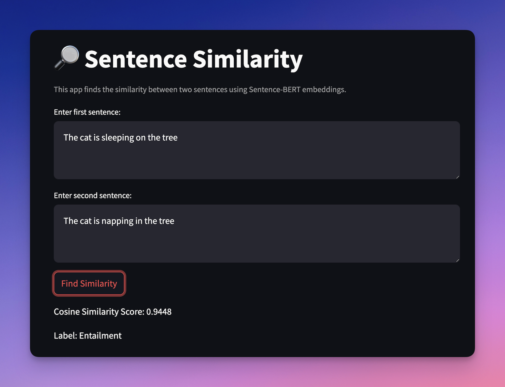

# Custom Sentence Transformer for NLI

## 🎯 Objective

Create a custom-trained sentence transformer model to predict Natural Language Inference (NLI)


## 🚀 Demo


## 📝 Steps

1. **Pre-train**: Train a sentence transformer using yahoo_answers_topics
2. **Fine-tune**: Use SNLI and MNLI datasets with saved pre-trained weights

   > **Credit**: Pre-training and fine-tuning codes are provided by **Chaklam Silpasuwanchai** and **Todsavad Tangtortan** as part of the Natural Language Processing course at the Asian Institute of Technology.

3. **Evaluate**: Generate a classification report
4. **Inference**: Find the cosine similarity between two sentences
5. **Interface**: Build a Streamlit app for user interaction


## 📦 Pre-training

* Dataset: `yahoo_answers_topics`
   * It's large, diverse, and covers multiple topics, making it perfect for sentence-level understanding.
   * Train set: `140,000` out of `1,400,000`
   * Used two columns: `best_answer` for text, and `topic` for labels (10 classes)

   > **Credit**: [Community Datasets on Hugging Face](https://huggingface.co/datasets/community-datasets/yahoo_answers_topics)

* Parameters:
   *  Max padding length: `2000`; handle long samples
   *  Batch size: `2`; limited memory on GPU
   *  Number of epochs: `1000`
* Training loss: `121.65` ⇒ `2.86`   
* Training time: `30m 55s`


## 🎛️ Fine-tuning

* Datasets: `SNLI` and `MNLI`
    * Both are gold standards for NLI tasks, perfect for fine-tuning.
    * Train set: `100,000`, Validation set: `10,000`, Test set: `10,000`
* Training loss: ___
* Training time: ___

* Classification Report:

   ```
                  precision    recall  f1-score   support
   
      entailment       0.34      0.35      0.35      3429
         neutral       0.32      0.49      0.39      3191
   contradiction       0.33      0.15      0.21      3380
   
        accuracy                           0.33     10000
       macro avg       0.33      0.33      0.31     10000
    weighted avg       0.33      0.33      0.31     10000
   ```

## Sample Sentence Pairs:

Original sentence: **The cat is sleeping on the tree**

| Deviated Sentences | Similarity Score ⬇️ |
| :----------------- | :----------------------------: |
| The cat is sleeping on the tree | 1.0000 |
| The cat is lounging in the tree | 0.9569 |
| The cat is napping in the tree | 0.9448 |
| The cat sleeps peacefully on the tree | 0.9395 |
| The cat is climbing the tree | 0.9273 |
| The cat is playing with the ball | 0.8724 |
| A cat is resting on the tree branch | 0.8675 |
| A dog is barking near the tree | 0.8417 |
| A feline is dozing atop the tree | 0.8002 |
| Birds are flying around the tree | 0.7289 |
| The tree is tall and green | 0.6552 |


# 💡 Why Cosine Similarity from 0 to 1 (Not -1)?

In real-world sentence embeddings, negative values are rare because the embeddings represent semantic spaces. Most vectors align positively, making the range from 0 (no similarity) to 1 (identical meaning) more practical and interpretable.
